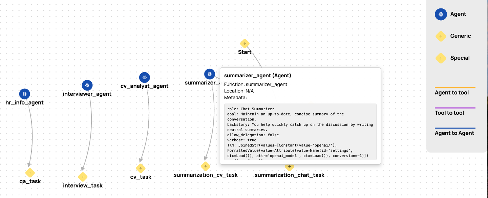

# Agents visualization and threat modeling with [Agent-Wiz](https://github.com/Repello-AI/Agent-Wiz)

0. Install `agent-wiz`:
```bash
pip install repello-agent-wiz
```

1. Export env variables:

```bash
export OPENAI_BASE_URL=http://localhost:1234/v1
export OPENAI_API_KEY=LMSTUDIO
```

2. Extract agents:

```bash
agent-wiz extract --framework crewai --directory ./backend/app/services --output ai_agent_graph.json
```

3. Visualize agents:

```bash
agent-wiz visualize --input ai_agent_graph.json --open
```



4. Generate the Thread Model:

```bash
agent-wiz analyze --input ai_agent_graph.json
```

For example of the Thread Model (generated by openai/gpt-oss-20b) see: [CrewAI_report.md](CrewAI_report.md)
